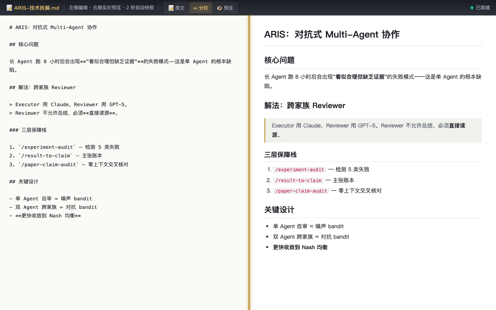
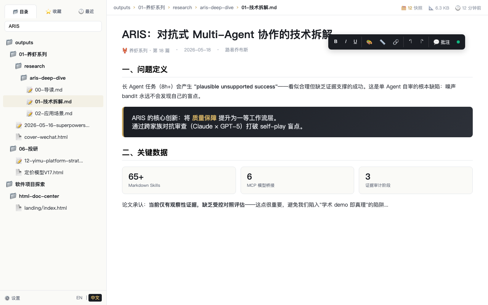
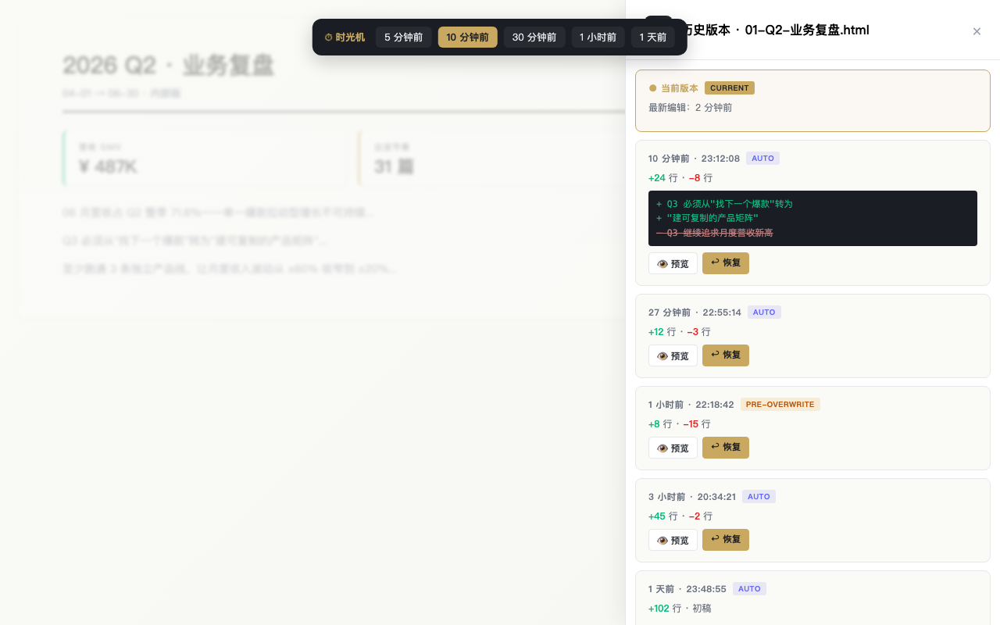
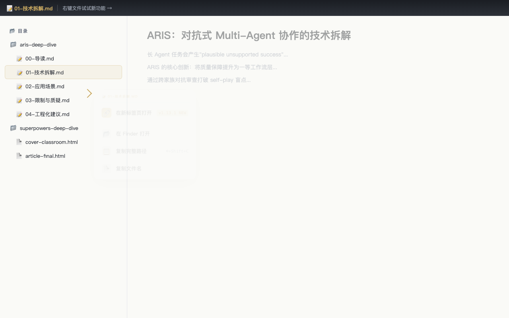

<div align="center">

# 🗂 HTML Doc Center

**Your local-first workbench for HTML files — browse, edit, version and share, all offline.**

*Built for the AI era, where we all generate too many HTML files and lose track of them.*

[](https://opensource.org/licenses/MIT)
[](https://github.com/louisecxqiu-glitch/html-doc-center/releases/latest)
[](https://www.python.org/)
[]()
[]()
[](#-connect--follow)
[](https://blog.csdn.net/qcx23)
[](https://x.com/louisqiu285052)

[English](#english) · [中文](#中文) · [Why](#why-html-doc-center) · [Quick Start](#quick-start) · [Features](#features) · [Connect](#-connect--follow)

</div>

> 💡 **A real workflow tool I built for myself**. If you're also drowning in Claude artifacts / ChatGPT canvas HTML files, this might help you too.
> Companion deep-dives on [WeChat 一深思AI](#-connect--follow), [CSDN](https://blog.csdn.net/qcx23) or [X @louisqiu285052](https://x.com/louisqiu285052).
>
> 🌐 **Bilingual UI** (since v1.12.0): English by default, with one-click switch to 中文 in the sidebar footer. Your choice is remembered locally.

---

<div align="center">



*Markdown three-view with drag-resizable splitter (v1.13) — one of 4 highlights. [See more screenshots ↓](#screenshots)*

</div>

---

## English

### Why HTML Doc Center?

In the AI era, we all generate **a lot** of HTML files:
- Claude artifacts / ChatGPT canvas outputs
- AI-generated reports, covers, decks, infographics
- Blog drafts, tutorials with interactive demos
- Single-file HTML presentations

And then they just… scatter. Across `Downloads/`, `Desktop/`, random folders. You can't find them, can't edit them inline, can't track versions, can't compare "this one" vs "the one I had yesterday".

**HTML Doc Center** is a zero-dependency, local-first workbench that brings it all together:

- 📂 **One place** to browse every HTML file across your scan roots
- ✏️ **Edit in place** with a WYSIWYG toolbar (bold/italic/color/align/link/image/position)
- 🕐 **Auto-versioning**: every 2 seconds after you stop typing, a snapshot is saved
- ⏰ **Time machine**: "jump back 5/10/30 minutes" with one click
- 🖼 **Image handling**: click to resize with Notion-style handles, drag to reorder
- 📐 **Element positioning**: Cmd+long-press any element → nudge with arrow keys
- 🔒 **100% local, 100% offline** — your files never leave your machine
- 🚀 **Zero npm deps** — one Python file + aiohttp, runs anywhere

### Quick Start

```bash
# 1. Clone
git clone https://github.com/louisecxqiu-glitch/html-doc-center.git
cd html-doc-center

# 2. Install the only dependency
pip install aiohttp

# 3. Copy the config template
cp config.example.json config.json
# Edit config.json — set scan_roots to directories containing your HTML files

# 4. Run
python3 server.py

# 5. Open
open http://localhost:9901
```

**First time?** Edit `config.json` and set `scan_roots` to directories you want DocCenter to scan. Example:

```json
{
  "scan_roots": [
    "~/Documents/reports",
    "~/Desktop/html-files"
  ],
  "port": 9901
}
```

That's it. No build step, no npm install, no Docker, no database.

### Features

#### 📂 Smart File Browsing
- Tree view of all HTML/Markdown across multiple scan roots
- 🔍 Search by file name **or path fragment** with match highlighting
- ⭐ Favorites & 🕐 Recent (localStorage-persisted)
- 3-tab sidebar: Directory / Favorites / Recent
- Auto-refresh every 10s (lightweight signature-based, 0.01% traffic cost)

#### ✏️ WYSIWYG Editing (via injected saver-runtime.js)
- **Rich text**: bold/italic/underline, font size, 14-color palette (with recent colors), highlight
- **Alignment**: left/center/right/justify
- **Links**: select text → prompt URL → auto-add `https://`
- **Advanced**: line-height, letter-spacing, code blocks, blockquotes
- **Images**: click to select → drag corner handles to resize, drag body to reposition within paragraph
- **Element positioning**: Cmd+hold any element for 300ms → popover with arrow-key nudging (1px / 10px with Shift)
- **Annotations**: inline comments with 💬 markers

#### 🕐 Version Timeline (the killer feature)
- Auto-snapshot every 2 seconds after typing stops
- Pre-overwrite backup when you explicitly save
- Pre-restore backup before rolling back (double safety)
- **Time Machine**: one-click buttons to jump back 5min / 10min / 30min / 1h / 1d
- Line-level diff between any snapshot and current
- Sparsify snapshots: gradient retention (10min all kept, 10-60min per minute, 1-24h per hour, >24h per day)

#### 🎨 UX Polish
- Light / Dark / Auto (follows system) themes — press `T` to toggle
- Keyboard shortcuts: `H` history, `R` refresh, `/` focus search, `?` help overlay
- Breadcrumb with file metadata (size, mtime, snapshot count)
- Click breadcrumb to copy relative path; long-press for absolute
- DECK mode for presentation HTMLs (full-screen keyboard navigation)

#### 🛡 Safety
- Path traversal protection (`_resolve_safe` guards every file I/O)
- Never serves files outside configured scan roots
- Dirty-state protection: confirms before closing unsaved changes
- Binary files excluded (only serves `.html` and `.md`)

### Screenshots

#### 📝 Markdown three-view (v1.13) — split / source / preview, drag-resizable


*One-click switch between **Source / Split / Preview**. Drag the gold splitter to resize panes (clamped 10%–90%). View mode and ratio persist in `localStorage`.*

#### 📂 Unified browser — all your local HTML/MD in one tree



*Three-tab sidebar (**Tree / Favorites / Recent**), live HTML rendering with injected WYSIWYG toolbar — here showing a quarterly business review with stat cards, bar chart, donut and insight box. Bilingual UI (EN / 中文).*

#### ⏱ Auto-snapshot + time machine — never lose anything you wrote



*Stop typing for 2 seconds → automatic snapshot. Top "**Time machine**" bar lets you jump to "5 / 10 / 30 minutes / 1 hour / 1 day ago". History drawer shows line-level diff and restores any version (with auto pre-restore backup).*

#### 🔗 Power user — context menu, drag-move, keyboard shortcuts



*v1.13.1: Right-click any file → **Open in new tab** (top item) for side-by-side comparison. Plus drag to move files across scan roots, global shortcuts (`H` history / `R` refresh / `/` search / `T` theme), and dark mode that follows your system.*

---

### Philosophy

DocCenter is built on 5 principles:

1. **Local first.** No cloud, no account, no telemetry. Your files never leave your machine.
2. **Zero dependencies.** One Python file + aiohttp. No npm, no build, no Docker.
3. **Single source of truth.** Every edit writes back to the original HTML file. No proprietary format.
4. **Progressive enhancement.** Existing editors on the HTML (review toolbars etc.) are auto-detected and respected.
5. **Evidence-based development.** Every version ships with a "user story" in the changelog — not just features.

### Architecture

```
┌─────────────────────────────────────────────┐
│  Your Browser (localhost:9901)              │
│  ┌──────────────┬────────────────────────┐  │
│  │ Sidebar      │  Iframe (your HTML)    │  │
│  │ - Tree       │  ┌──────────────────┐  │  │
│  │ - Favorites  │  │ saver-runtime.js │  │  │
│  │ - Recent     │  │ (injected)       │  │  │
│  │ - Search     │  │ - Toolbar        │  │  │
│  │              │  │ - Auto snapshot  │  │  │
│  │              │  │ - contenteditable│  │  │
│  │              │  └──────────────────┘  │  │
│  └──────────────┴────────────────────────┘  │
└──────────────┬──────────────────────────────┘
               │ HTTP (JSON + HTML)
               ▼
┌─────────────────────────────────────────────┐
│  server.py (aiohttp, single file)           │
│  - GET  /                → shell            │
│  - GET  /api/tree        → directory tree   │
│  - GET  /api/file        → HTML + inject    │
│  - POST /api/snapshot    → auto-save        │
│  - POST /api/save        → overwrite/new    │
│  - GET  /api/history     → timeline         │
│  - POST /api/restore     → rollback         │
└─────────────────────────────────────────────┘
               │
               ▼
        Your HTML files
   (~/Documents, etc. — wherever
    you configured scan_roots)
```

### Roadmap

See [`docs/superpowers/plans/2026-05-14-v1.12-roadmap.md`](docs/superpowers/plans/2026-05-14-v1.12-roadmap.md) for the next wave:
- **v1.12.0** Table editing (insert rows/cols, merge cells)
- **v1.12.1** Full-text content search (not just file names)
- **v1.12.2** Cross-file diff
- **v1.12.3** Smart undo stack (across all contenteditable operations)

### Contributing

PRs welcome! See [CONTRIBUTING.md](CONTRIBUTING.md) for guidelines.

The project follows a unique **"user story first"** changelog discipline — every feature-level version must describe the real user scenario it solves. See [ITERATION-SOP.md](ITERATION-SOP.md) for the 5 ironclad rules we live by.

### License

[MIT](LICENSE) © Louis Qiu

---

## 中文

### 为什么做 HTML Doc Center？

AI 时代我们每个人都在生成**大量** HTML 文件：
- Claude artifacts / ChatGPT canvas 的输出
- AI 生成的报告、封面、deck、信息图
- 博客草稿、带交互示例的教程
- 单文件 HTML 演示

然后它们就……散落各处。`Downloads/` / `Desktop/` / 各种随机目录。找不到、没法原地编辑、没有版本、没法对比"今天这份" vs "昨天那份"。

**HTML Doc Center** 是一个零依赖、本地优先的工作台，把它们都收拢在一起：

- 📂 **一个入口**浏览所有扫描根下的 HTML
- ✏️ **原地编辑**，WYSIWYG 工具栏（加粗/斜体/字色/对齐/链接/图片/位置）
- 🕐 **自动版本化**：停手 2 秒就存快照
- ⏰ **时光机**："回到 5/10/30 分钟前"一键跳转
- 🖼 **图片操作**：Notion 式四角 resize 手柄、段内拖拽
- 📐 **元素位置微调**：Cmd + 长按任意元素 → 方向键像素精度移动
- 🔒 **100% 本地、100% 离线** — 你的文件永远不离开你的机器
- 🚀 **零 npm 依赖** — 一个 Python 文件 + aiohttp，哪都能跑

### 快速上手

```bash
# 1. 克隆
git clone https://github.com/louisecxqiu-glitch/html-doc-center.git
cd html-doc-center

# 2. 安装唯一依赖
pip install aiohttp

# 3. 复制配置模板
cp config.example.json config.json
# 编辑 config.json — 把 scan_roots 改成你 HTML 文件所在的目录

# 4. 启动
python3 server.py

# 5. 打开
open http://localhost:9901
```

没有构建步骤、没有 npm install、没有 Docker、没有数据库。

### 设计哲学

DocCenter 基于 5 条原则：

1. **本地优先** — 无云、无账号、无上报
2. **零依赖** — 一个 Python 文件 + aiohttp
3. **单一真相** — 每次编辑直接写回原 HTML，无专有格式
4. **渐进增强** — 原 HTML 已有的编辑器（如批注工具栏）自动识别并尊重
5. **证据驱动** — 每个版本都带"用户故事"，不只是功能列表

### 许可证

[MIT](LICENSE) © Louis Qiu

---

## 📢 Connect & Follow

If DocCenter helps you, I'd love to stay in touch:

<table>
<tr>
<td width="34%" align="center">

### 微信公众号「一深思AI」


**扫码关注** · AI 工作流、工具实战、Agent 深度拆解
<br>
持续更新《养虾系列》—— AI Agent 实战方法论

</td>
<td width="33%" align="center">

### CSDN 技术博客

<a href="https://blog.csdn.net/qcx23">

</a>

**👉 [blog.csdn.net/qcx23](https://blog.csdn.net/qcx23)**
<br>
技术长文 · 工具开源 · 工程实战复盘

</td>
<td width="33%" align="center">

### X (Twitter)

<a href="https://x.com/louisqiu285052">

</a>

**👉 [@louisqiu285052](https://x.com/louisqiu285052)**
<br>
English build-in-public · AI tooling · DocCenter updates

</td>
</tr>
</table>

### 🌟 Support this project

- ⭐ **Star this repo** — 持续维护的最大动力
- 🐛 **Report bugs** via [Issues](../../issues)
- 💡 **Suggest features** via [Discussions](../../discussions)
- 🔗 **Share it** with anyone drowning in AI-generated HTML files
- 📝 **Read the full story** on my [WeChat](#-connect--follow), [CSDN](https://blog.csdn.net/qcx23) or [X](https://x.com/louisqiu285052)

### 📝 Related writing

本项目配套深度解析文章陆续在公众号「一深思AI」和 CSDN 更新：

- 《我为什么要做一个本地 HTML 工作台》
- 《从 0 到 10000 行：DocCenter v1.0 → v1.11 迭代复盘》
- 《AI 时代的本地优先软件设计》
- 《养虾系列》— AI Agent 实战方法论

---

<div align="center">

**⭐ 喜欢就 star 一下，关注公众号「一深思AI」，每周深度更新**

*Built with ❤️ by Louis Qiu · Made in China · MIT Licensed*

</div>
