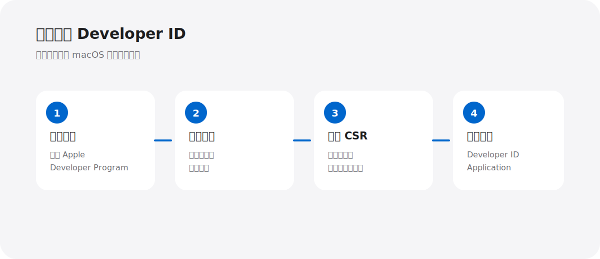
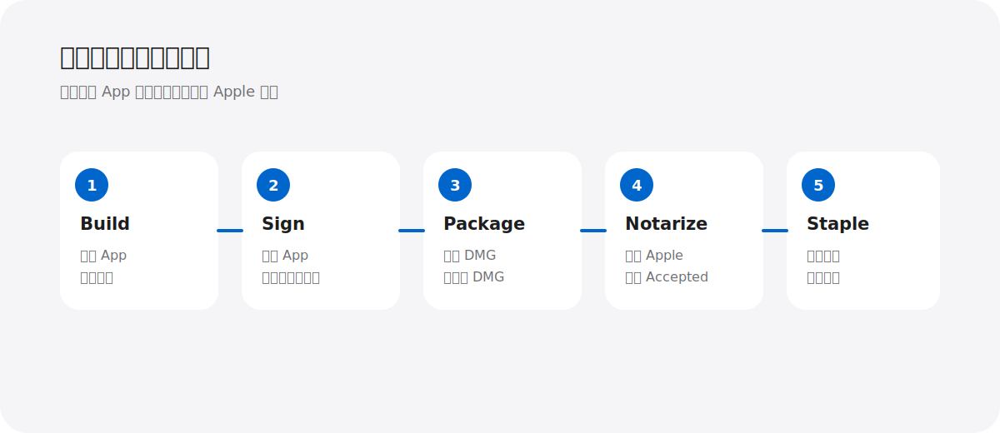

# macOS DMG 独立分发完整指南

如果你做了一个 Mac 应用，想把它发给客户、同事或朋友，通常会遇到两个问题：

1. 为什么双击 App 会出现“无法验证开发者”？
2. 为什么一个看起来正常的 DMG，到了别人电脑上却被 Gatekeeper 拦截？

这篇文章从零开始，带你完成个人开发者的 macOS 独立分发流程。



## 先说结论：直接分发不等于上架 App Store

如果你的目标是把 DMG 放到自己的网站、GitHub Releases、网盘或公司内网中，**不需要把 App 上架到 Mac App Store**。

但是，你仍然需要：

- Apple Developer Program 会员资格
- Developer ID Application 证书
- Hardened Runtime（硬化运行时）
- Apple Notary Service 公证
- 最终的 Gatekeeper 验证

App Store 分发是另一套流程，使用的是 Mac App Distribution 证书和 App Store Connect。本文只讨论“自由分发 DMG”。

## 第一步：注册 Apple Developer Program


打开 [Apple Developer Program](https://developer.apple.com/programs/)，使用你的 Apple ID 注册并加入 Apple Developer Program。

个人开发者通常需要支付每年 99 美元的会员费用，具体金额可能会根据地区和税费显示不同。缴费成功并通过审核后，你会收到 Apple 的确认邮件。

个人账号就可以完成本文的流程，不需要注册公司账号。

### 注册时你需要准备什么

- 一个已开启双重认证的 Apple ID
- 可支付年费的支付方式
- 真实姓名和联系方式
- 能接收邮件的邮箱
- 一台用于生成 CSR 和保存私钥的 Mac

### 重要提醒

Apple Developer 会员资格不是“上架 App Store”的专属门票。对于本文的独立分发场景，它的核心用途是让你能够创建 Developer ID 证书并使用公证服务。

## 第二步：创建 Developer ID Application 证书

证书解决的是“这个 App 是谁签名的”。

在 [Certificates, Identifiers & Profiles](https://developer.apple.com/account/resources/certificates/list) 中：

1. 点击右上角的“+”
2. 选择 Developer ID Application
3. 选择现代的 G2 Sub-CA
4. 上传 CSR 文件
5. 点击 Continue
6. 下载 .cer 文件
7. 双击 .cer，安装到“登录”钥匙串

不要把 Developer ID Application 和 Developer ID Installer 混在一起。本文分发的是 App 和 DMG，应该使用 Application 证书。

## 第三步：生成 CSR，并确认私钥配对

打开 macOS 的“钥匙串访问”。

注意：菜单在 Mac 屏幕最顶部，不是在钥匙串访问窗口内部。

选择：

```text
钥匙串访问
  → 证书助理
  → 从证书颁发机构请求证书
```

填写：

| 字段 | 填写内容 |
| --- | --- |
| 用户电子邮件地址 | 你的 Apple ID 邮箱 |
| 常用名称 | 例如：Your Name Developer ID |
| CA 电子邮件地址 | 留空 |
| 请求是 | 存储到磁盘 |

生成 CSR 后，私钥会留在“登录”钥匙串里。下载 Apple 返回的 .cer 后，双击安装。

最终在“钥匙串访问 → 登录 → 我的证书”中确认：证书左边可以展开，并且下面有对应私钥。

终端检查：

```bash
security find-identity -v -p codesigning
```

你应该看到类似：

```text
Developer ID Application: Your Name (TEAM_ID)
```

如果只看到证书，展开后没有私钥，说明证书和 CSR 不是同一对，需要重新生成。

## 第四步：准备公证凭据

公证服务需要验证你的 Apple 账号。

### 创建 App 专用密码

打开 [Apple Account](https://account.apple.com/)，进入：

```text
登录与安全
  → App 专用密码
  → 生成 App 专用密码
```

这串密码不是 Apple ID 主密码，也不是 Mac 登录密码。

### 将凭据保存到钥匙串

把下面的占位符替换成自己的信息：

```bash
xcrun notarytool store-credentials "HTMLStudio-notary" \
  --apple-id "<APPLE_ID>" \
  --team-id "<TEAM_ID>"
```

命令提示输入密码时，粘贴刚才生成的 App 专用密码。

验证凭据：

```bash
xcrun notarytool history \
  --keychain-profile "HTMLStudio-notary"
```

## 第五步：构建并签名 App

进入项目目录：

```bash
cd "/path/to/html-doc-center"
```

设置本次构建变量：

```bash
SIGNING_IDENTITY="Developer ID Application: Your Name (TEAM_ID)"
VERSION="$(tr -d '[:space:]' < VERSION)"
APP="dist/HTMLStudio.app"
DMG="dist/HTMLStudio-$VERSION-macos-arm64.dmg"
```

先删除旧产物：

```bash
rm -rf build dist HTMLStudio.spec
```

安装构建依赖：

```bash
python3 -m pip install -r requirements-build.txt
```

构建 App，并让 PyInstaller 签名内部框架、动态库和可执行文件：

```bash
python3 build.py \
  --version "$VERSION" \
  --codesign-identity "$SIGNING_IDENTITY"
```

签名前清除无关扩展属性：

```bash
xattr -cr "$APP"
```

对外层 App 开启 Hardened Runtime 并加时间戳：

```bash
codesign --force \
  --timestamp \
  --options runtime \
  --entitlements packaging/macos/entitlements.plist \
  --sign "$SIGNING_IDENTITY" \
  "$APP"
```

严格验证：

```bash
codesign --verify \
  --deep \
  --strict \
  --verbose=2 \
  "$APP"
```

成功时应该看到：

```text
valid on disk
satisfies its Designated Requirement
```

检查 Apple Silicon 架构：

```bash
lipo -archs "$APP/Contents/MacOS/HTMLStudio"
```

应该输出：

```text
arm64
```

从这一步开始，不要再向 App 包内部写入配置、日志或其他文件。

## 第六步：创建并签名 DMG

先准备 DMG 展示目录：

```bash
rm -rf build/dmg-root
mkdir -p build/dmg-root
ditto "$APP" "build/dmg-root/HTMLStudio.app"
ln -s /Applications "build/dmg-root/Applications"
```

创建 DMG：

```bash
hdiutil create \
  -volname "HTML Studio" \
  -srcfolder "build/dmg-root" \
  -format UDZO \
  -ov \
  "$DMG"
```

对最终 DMG 单独签名：

```bash
codesign --force \
  --timestamp \
  --sign "$SIGNING_IDENTITY" \
  "$DMG"
```

验证 DMG：

```bash
codesign --verify --verbose=4 "$DMG"
hdiutil verify "$DMG"
```

记录公证前哈希：

```bash
shasum -a 256 "$DMG"
```

这一步之后不要重新生成、重新签名或修改 DMG。签名后改内容，会导致 codesign 或公证失败。



## 第七步：使用 notarytool 提交公证

提交时只提交一次：

```bash
xcrun notarytool submit "$DMG" \
  --keychain-profile "HTMLStudio-notary" \
  --wait
```

记下 Apple 返回的提交 ID：

```text
xxxxxxxx-xxxx-xxxx-xxxx-xxxxxxxxxxxx
```

如果本地等待时间太长，可以按 Control + C 结束本地等待，但不要再次提交同一个 DMG。服务器上的任务会继续处理。

查询状态：

```bash
xcrun notarytool info "<SUBMISSION_ID>" \
  --keychain-profile "HTMLStudio-notary"
```

### Accepted

下载公证日志。即使 Accepted，也建议检查日志中的 warning：

```bash
xcrun notarytool log "<SUBMISSION_ID>" \
  --keychain-profile "HTMLStudio-notary" \
  "notarization-log.json"
```

### Invalid

打开 notarization-log.json 查看具体错误。修复后必须从“清理旧产物”开始重新构建、签名和提交，不要在原 DMG 上直接补签。

### In Progress

继续使用 notarytool info 查询。不要重复提交第三份、第四份 DMG。

## 第八步：Staple 公证票据

只有状态为 Accepted 才执行：

```bash
xcrun stapler staple -v "$DMG"
xcrun stapler validate -v "$DMG"
```

注意：staple 会修改 DMG，所以 stapling 后的哈希和提交前哈希不同是正常现象。

## 第九步：Gatekeeper 最终验证

执行完整验证：

```bash
codesign --verify --verbose=4 "$DMG"
hdiutil verify "$DMG"
spctl --assess \
  --type open \
  --context context:primary-signature \
  --verbose=4 \
  "$DMG"
```

成功时通常会看到：

```text
accepted
source=Notarized Developer ID
```

最终可自由分发的文件是：

```text
dist/HTMLStudio-2.6.0-macos-arm64.dmg
```

你可以把它放到 GitHub Releases、自己的网站、网盘或公司内网，不需要上传 Mac App Store。

## 常见问题

### “输入登录钥匙串密码”是什么？

这是当前 Mac 用户的登录密码，不是 Apple ID 密码，也不是 App 专用密码。

### 为什么签名验证失败？

最常见原因是签名完成后，流程又改写了 Contents/Resources、日志、配置或隐藏文件。修复方式是清理 build 和 dist，重新构建，并严格按照“签名 App → 创建 DMG → 签名 DMG → 公证”的顺序执行。

### 为什么长时间 In Progress？

先用提交 ID 查询状态。不要重复提交。新账号、首次公证或 Apple 后台队列都可能增加等待时间；如果持续异常，查看 [Apple Developer 系统状态](https://developer.apple.com/system-status/) 并联系 [Apple Developer Support](https://developer.apple.com/contact/)。

## 最终检查清单

- [ ] Apple Developer Program 已注册并通过审核
- [ ] Developer ID Application 证书与私钥已配对
- [ ] App 开启 Hardened Runtime
- [ ] App 签名验证通过
- [ ] DMG 创建后单独签名
- [ ] DMG 公证状态为 Accepted
- [ ] stapler validate 通过
- [ ] codesign、hdiutil、spctl 全部通过
- [ ] 只分发最终的 DMG，不分发 unnotarized 文件


