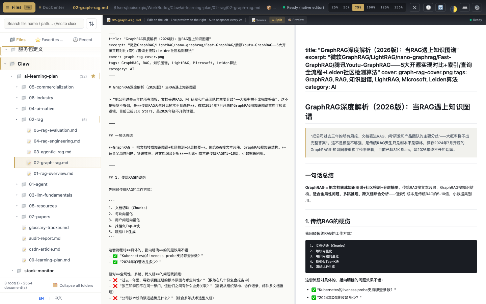
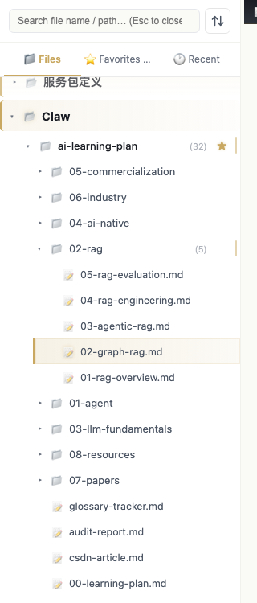
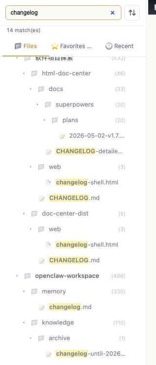
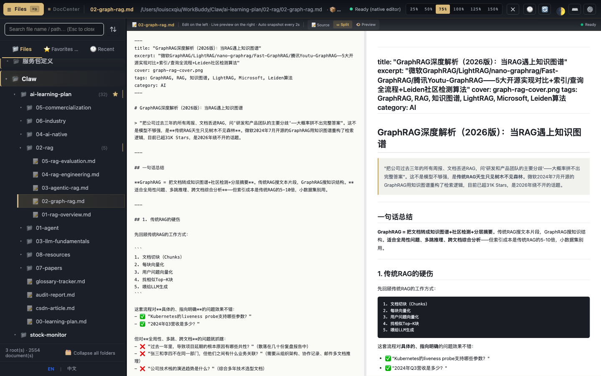
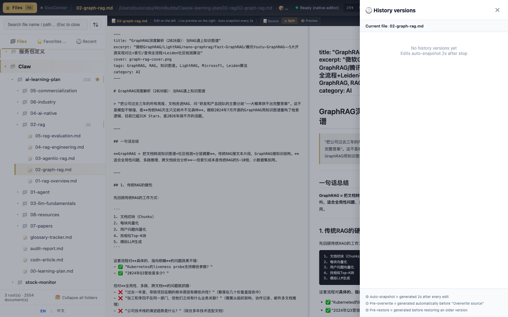
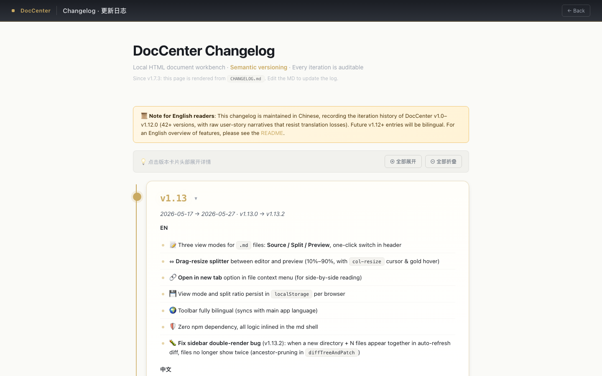

# 从零到 v1.13：我用 AI Agent 迭代了一个本地文档工作台

> AI 应用大赛参赛作品 · HTML Document Center

---

## 一、背景与痛点

### 我遇到的问题

作为一个重度使用 AI 辅助工作的开发者，我每天会产出大量 HTML 格式的报告、分析文档和演示材料——竞品分析报告、投资研报、项目汇报 Deck、公众号文章预览……这些文件散落在本地不同目录中，管理它们成了一个令人头疼的问题。

**痛点 1：文件散落，找不到**

上周写的那份架构分析在哪？outputs 目录下 200+ 个 HTML 文件，肉眼扫根本找不到。浏览器只能一个一个双击打开，对比两份文档需要开两个窗口来回切。

**痛点 2：修改怕覆盖，没有版本管理**

AI 帮你生成了一份还不错的报告，你想微调几个措辞、改个标题。但改完发现不如原来的好，却已经 Ctrl+S 覆盖了——原版回不来了。本地文件不是 Git 仓库，没有版本历史。

**痛点 3：编辑割裂，工具切换成本高**

想给报告加个批注？要么开 VS Code 改源码（HTML 标签里加文字体验极差），要么用浏览器的开发者工具临时改（刷新就没了）。没有一个工具能让你"像编辑文档一样编辑 HTML"。

**痛点 4：Markdown 是主力写作格式，但预览和 HTML 割裂**

很多文档是 Markdown 格式，预览需要另开工具，和 HTML 报告不在一个界面里，无法统一管理。

### 为什么现有工具不能解决？

| 工具 | 局限 |
|------|------|
| VS Code | 代码编辑器，所见非所得 |
| 浏览器直接打开 | 无目录管理、无版本历史、无编辑 |
| Notion / 飞书 | 需要上传，不支持原生 HTML 渲染 |
| 本地 HTTP Server | 只能看不能编辑，没有快照 |

**核心矛盾：本地 HTML 文件需要一个"浏览器 + 编辑器 + 版本管理"三合一的轻量工具，但市面上没有。**

---

## 二、效果与功能

**HTML Document Center** —— 一个本地 HTML/Markdown 文档工作台。`python3 server.py` 一行命令启动，零 npm 依赖，3 秒可用。

---

### 功能一：全局工作台 · 所见即所得



打开 DocCenter，左侧是智能目录树，右侧是文档的实时预览与编辑区。顶栏集成了面包屑导航、缩放控制（25%~150%）、编辑状态指示器。

**Markdown 文件原生支持三视图**：Source（纯源码）、Split（分栏实时预览）、Preview（纯预览）。分栏比例可拖拽调整，状态自动记忆。

核心设计原则：**打开即可编辑，无需任何配置**。HTML 文件自动注入轻量工具栏（加粗/斜体/高亮/链接/色板/对齐），Markdown 文件自动渲染预览。如果原 HTML 已有自己的编辑器，DocCenter 会自动检测并跳过注入。

---

### 功能二：三 Tab 侧栏 · 文件管理中枢



侧栏分为三个 Tab：

- **📂 Files**：树形目录，支持多根扫描、嵌套展示、文件数统计
- **⭐ Favorites**：一键收藏常用文件，跨目录快速访问
- **🕐 Recent**：最近打开记录，自动维护

目录树每 30 秒自动刷新——外部新增/删除文件无需手动操作。空目录自动剪枝，2554 个文件也能流畅渲染。

---

### 功能三：智能搜索 · 路径片段匹配



搜索框支持：
- **路径片段匹配**：输入 `changelog` 即可找到所有路径中包含该关键词的文件
- **匹配高亮**：关键词在文件名中金色高亮
- **匹配计数**：顶部实时显示 `14 match(es)`
- **结构保留**：搜索结果仍保持目录层级结构，而非扁平列表

按 `/` 快捷键即可聚焦搜索框，Esc 清空并关闭。

---

### 功能四：暗色主题 · 护眼长时间工作



三种主题模式：亮色 / 暗色 / 跟随系统。按 `T` 键一键切换，选择记入 `localStorage` 持久化。

暗色模式下侧栏、顶栏、编辑区全面适配——不是简单的 `filter: invert()`，而是精心调配的深色调色板，确保文档内容的可读性和代码块的对比度。

---

### 功能五：版本时间线 · 无感知自动快照



这是 DocCenter 最核心的差异化能力：

- **停手 2 秒自动快照** —— 你不需要记得按 Ctrl+S，系统在你停止编辑 2 秒后自动保存一个版本
- **History Drawer** —— 右侧抽屉展示该文件的完整版本时间线
- **三种快照类型**：Auto-snapshot（自动）、Pre-overwrite（覆盖前备份）、Pre-restore（恢复前备份）
- **行级 Diff** —— 对比任意两个版本的精确差异

关闭文件时的三选一决策：✅ 覆盖源文件 / 🆕 另存为审阅版 / 🗑 丢弃修改。覆盖前自动备份，永远有后悔药。

---

### 功能六：CHANGELOG 时间轴 · 产品叙事



访问 `/changelog` 查看完整的产品迭代时间线。每个版本卡片包含：

- 版本号 + 时间范围
- 双语功能描述（EN + 中文）
- 支持全部展开/折叠，默认只展开最新版本

这个时间轴本身就是"用架构消灭纪律"的产物（详见第四章经验 1）——由 `CHANGELOG.md` 动态渲染，单一数据源，零手动同步。

---

### 技术亮点一览

| 特性 | 实现方式 |
|------|----------|
| 零 npm 依赖 | 全部前端逻辑手写 vanilla JS，无 React/Vue/Webpack |
| 单进程后端 | Python 3 + aiohttp，~300 行搞定全部 API |
| 路径安全 | `_resolve_safe()` 单函数守住全部文件 I/O |
| 脏状态精准检测 | 三道护栏防误报（交互窗口 800ms + MutationObserver 限制 + 延迟 1s 观察） |
| 注入不污染源文件 | `serializeHTML()` 回写时自动剥离所有 DocCenter 注入代码 |
| 增量目录刷新 | `diffTreeAndPatch` 只更新变化的 DOM 节点，不重绘整棵树 |

---

## 三、如何用 Superpowers 进行 AI 驱动迭代

### 什么是 Superpowers 方法论？

Superpowers 是一套 **AI Agent 开发工作流**——把软件迭代拆分为结构化的阶段，每个阶段对应一个 Skill（能力模块），确保 AI 不是"拍脑袋写代码"，而是走一套可复现的工程流程。

```
brainstorming → writing-plans → executing-plans → verification → code-review
   (需求)       (设计)         (实现)          (验证)        (审查)
```

### 真实案例：20 个 Plan 文件驱动 54 个版本

从 v1.0 到 v1.13.2，项目共迭代了 **54 个版本**（13 个 Minor + 41 个 Patch），产出了 **20 份 Plan 文件**，每一份都有标准结构：

```markdown
# v1.11 编辑体验精炼 Implementation Plan
> For agentic workers: REQUIRED SUB-SKILL: Use superpowers:executing-plans

**Goal:** 解决四大顽疾——信息密度爆炸、编辑器能力残缺、侧栏三区挤兑、图片无法可视化操纵

**Architecture:** 5 个子版本分阶段解决，每个独立发布、独立回滚

## Task 1 · v1.11.0 · CHANGELOG 默认折叠
**Why:** 单个版本卡片占一屏多，翻 CHANGELOG 要滚很久
- [ ] Step 1.1: 读现有结构了解渲染逻辑
- [ ] Step 1.2: 加折叠容器
- [ ] Step 1.3: 最新一条默认展开
- [ ] Step 1.8: 浏览器验证
- [ ] Step 1.9: CHANGELOG 更新
- [ ] Step 1.10: git commit
```

### 迭代 SOP 的四条硬规矩

1. **无 Plan 不动手** —— 多步任务必须先在 `docs/superpowers/plans/` 下建 Plan，Bug 修复也要先说清"问题/根因/解法"三段式
2. **代码改动 = Plan 勾选 + CHANGELOG 更新** —— 缺一不可
3. **完成声明前先 Verify** —— 至少贴一次真实命令输出（不是"我觉得没问题"）
4. **Feature 级变更必写用户故事** —— 不能只有功能清单，必须有"为什么做这事"

### Superpowers 的实际收益

| 维度 | 没有 Superpowers | 有 Superpowers |
|------|-----------------|----------------|
| 需求理解 | AI 拿到一句话就开始写 | brainstorming 先澄清 10 个问题 |
| 实现质量 | 一坨代码直接提交 | 每个 Task 有 Why + Steps + 验收标准 |
| Bug 频率 | v1.11 系列 12 个 Patch 含 11 次 hotfix | v1.12/v1.13 首版就稳 |
| 可追溯性 | "这行代码为什么这么写？" | Plan 文件 + CHANGELOG 三段式完整记录 |
| 协作效率 | AI 经常跑偏重做 | Plan 是"合同"，双方对齐后才动手 |

---

## 四、有启发的经验

### 经验 1：用架构消灭纪律——从"三写铁律"到"二写"

v1.0~v1.7 期间，每次改代码要手动同步三个地方：`CHANGELOG.md`、`CHANGELOG.html`、`git commit`。依靠 SOP 和铁律强制执行，但仍然多次发生漂移。

**v1.7.3 的顿悟**：用户问了一句"为什么不做成动态加载？"——一句话戳中本质。

**解法**：`/changelog` 路由返回壳子 HTML，用 `marked.min.js` 实时渲染 `CHANGELOG.md`。从此 CHANGELOG 只有一份真相——MD 文件。纪律从三写降到二写，漂移消失。

> **启发：如果一条规则需要反复执行检查才能遵守，说明架构有问题。好的架构让正确的做法成为唯一的做法。**

### 经验 2：自驱 ≠ 跳过验收——v1.11 的 11 次 Hotfix 教训

v1.11 是我让 AI 第一次"自驱 10 轮不打断"的实验。结果：功能全部实现了，但产生了 11 次 hotfix。

根因分析后发现 4/11 次是"自我验证不足"——AI 跑了 curl 返回 200 就说"完成"，但浏览器里一开就坏（CSS 优先级冲突、JS 闭包作用域、时序竞态）。

**从此立了 5 条反 Bug 铁律**，最核心的一条：

> **curl 200 ≠ 用户体验正常。修改前端代码后，commit 前必须在浏览器里以用户视角实际操作。验收报告要写"我点了 X 看到了 Y"，不能只贴 HTTP 状态码。**

### 经验 3：Plan 文件是"AI 合同"

Plan 不是给人看的文档——它是 AI Agent 的执行合同。有了 Plan：

- AI 不会跑偏（每个 Step 都有明确边界）
- 出了 Bug 能精确定位（是哪个 Task 的哪个 Step 出了问题）
- 多次对话不丢上下文（新会话读 Plan 文件就能接上）
- 版本可回滚（每个子版本独立发布，出问题只回退一步）

**最佳实践**：Plan 的粒度不要太粗也不要太细。一个 Plan 覆盖一个 Minor 版本（3~5 个 Task），每个 Task 5~10 个 Step。太粗 AI 仍然会乱来，太细反而成了微管理。

### 经验 4：让 Bug 变成 SOP——三段式强制复盘

每个重要 Bug 都必须写"问题/根因/解法"三段式。这不是形式主义——它强迫你（和 AI）思考根因而不是贴创可贴。

真实案例（v1.13.2）：

```
问题：侧边栏搜索 step 时，6 个文件各显示 2 次
根因：diffTreeAndPatch 处理新增节点时，父目录 renderNode 已递归生成子节点，
     但循环随后又单独 renderNode 每个子文件 → 双重渲染
解法：added 列表内做祖先剪枝——若祖先也在 added 里，跳过子节点
```

三段式写多了，AI 自己也学会了这种思维模式——遇到 Bug 不是先改代码，而是先分析根因。

### 经验 5：零依赖的力量

整个前端没有 React、没有 Vue、没有 Webpack、没有 node_modules。全部手写 vanilla JS + CSS。

这不是技术洁癖，而是实际收益：
- **AI 改得动**：没有框架"黑箱"，AI 能精确定位和修改任何一行
- **启动快**：`python3 server.py` 一行命令，3 秒可用
- **调试直接**：浏览器 F12 看到的就是运行的代码
- **体积极小**：整个项目 < 200KB（不含文档）

> **启发：对于 AI 驱动的项目，简单架构 > 复杂框架。AI 能理解的代码才是好代码。**

### 经验 6：迭代节奏——每天几十个小版本 vs 憋大招

从 v1.0 到 v1.13.2，**54 个版本在 40 天内完成**。最密集的一天（5 月 13~14 日）发了 v1.10.7~v1.11.11 共 17 个版本。

这不是混乱——每个版本都有独立 Plan、独立 CHANGELOG 卡片、独立 git commit。小步快跑的好处：

- 每步可回滚，风险可控
- 用户（我自己）即时获得反馈
- Bug 影响范围小，定位快
- AI 上下文短，回答质量高

---

## 五、总结

HTML Document Center 不是一个复杂的项目——它只有 300 行后端 + 2000 行前端。但它完整展示了一个 AI 驱动的软件开发可以是什么样子：

1. **用 Superpowers 方法论**把"AI 帮忙写代码"升级为"AI 按工程流程迭代产品"
2. **用 Plan 文件**建立 AI 和人之间的"合同"，让每一步都可追溯、可复现
3. **用铁律和三段式**把踩坑经验沉淀为可执行的 SOP，越迭代越稳
4. **用简单架构**让 AI 能完全理解和修改代码，而不是被框架束缚

最终得到的不只是一个好用的工具，更是一套 **"人-AI 协作开发"的实践方法论**。

---

> 📎 项目地址：本地 `http://localhost:9901`
> 📎 技术栈：Python 3 + aiohttp + vanilla JS/CSS，零 npm 依赖
> 📎 迭代记录：20 份 Plan 文件 + 54 个版本（40 天） + 5 条铁律

